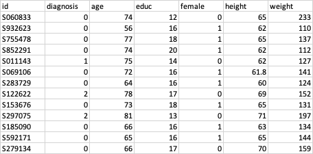
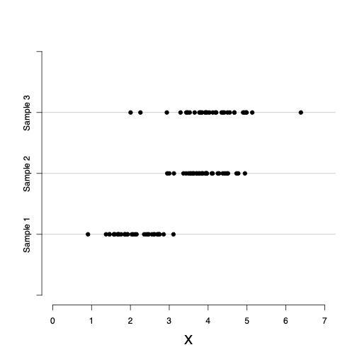
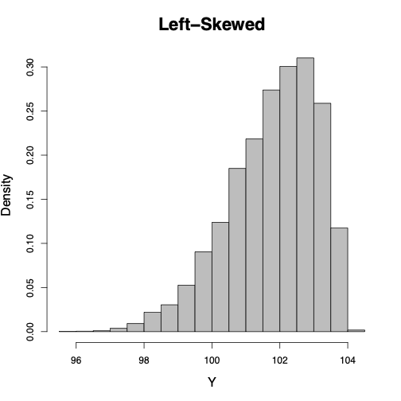
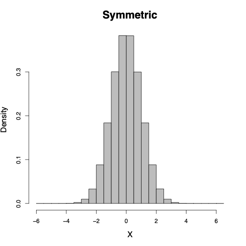
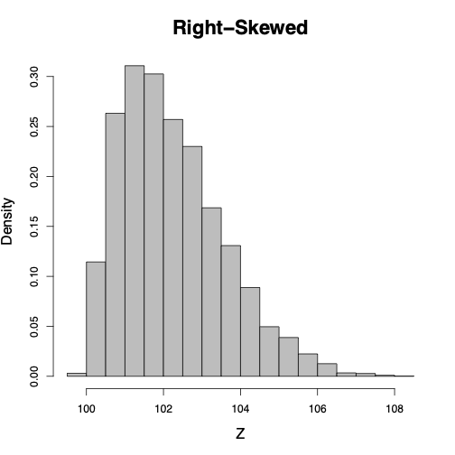
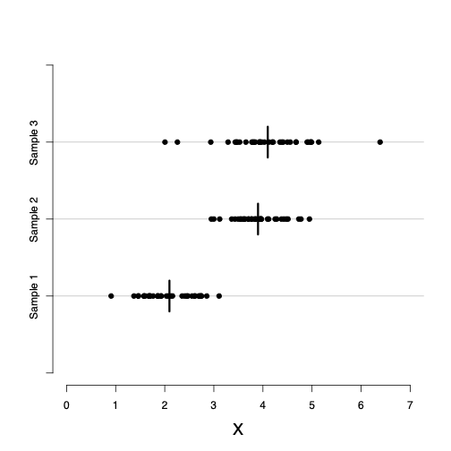
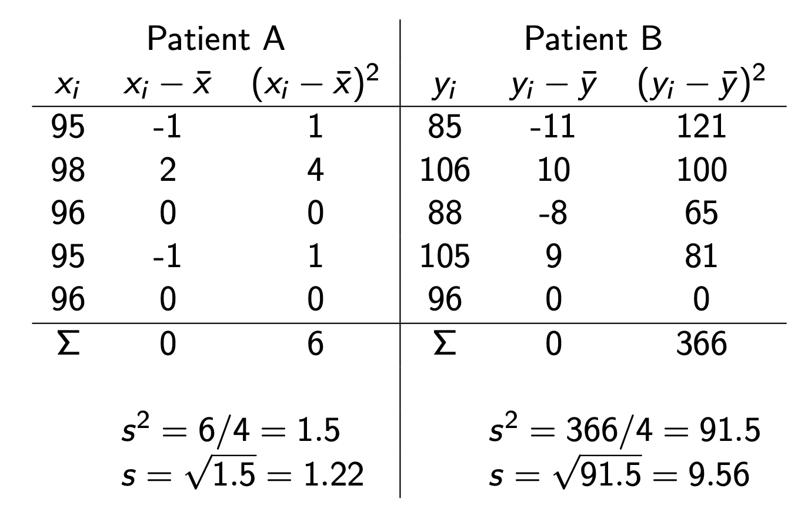
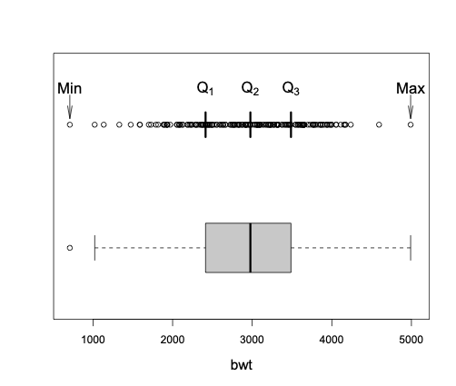

class: title-slide

```{r echo = FALSE, message=FALSE}
library(openintro)
library(tidyverse)
library(janitor)

alzheimer_data <- read.csv('data/alzheimer_data.csv') %>% 
  select(id, diagnosis, age, educ, female, height, weight) %>% 
  mutate(diagnosis = as.factor(diagnosis), female = as.factor(female))

```


<br>
<br>
.right-panel[ 
<br>

# `r rmarkdown::metadata$title`

## `r rmarkdown::metadata$author`

]

---

class: middle

## Reminder

- Close all apps on your computer other than RStudio.  
- Open slides for this session from the cluster website (https://cosmos-datascience.netlify.app). 


---

class: middle

## Objective

- We start by focusing on data exploration techniques for one variable at a time. 

- Our objective is to develop a high-level understanding of the
data, learn about the possible values for each characteristic, and find
out how a characteristic varies among individuals in our sample.

- In short, we want to learn about the __distribution__ of variables.


---

class: middle center

## Data cycle

```{r echo=FALSE, out.width='100%'}
knitr::include_graphics('img/data-cycle.png')
```

.footnote[Image from Grolemund, G., & Wickham, H. (2018). R for data science (CC BY-NC-ND 3.0).]


---

class: inverse center middle

.font100[Alzheimer's Data]

---

```{r}
head(alzheimer_data)
```

---


```{r}
tail(alzheimer_data)
```

---


```{r}
glimpse(alzheimer_data)
```

---

```{r}
ncol(alzheimer_data)
```

---

```{r}
nrow(alzheimer_data)
```


---

class: inverse middle center

.font100[Variable Types]


---

## Variables

```{r echo=FALSE, out.width='90%', fig.align='center'}

```


---

## Variables

- Variables `age`, `height`, and `weight` are __numerical variables__ since they take numerical values, and the numbers have their usual meaning.

- We can do certain analyses using these variables such as finding an average or the maximum or minimum meaningfully.

- Not everything represented by numbers represents a numeric quantity. e.g. `diagnosis`.

- These are are __categorical variables__ since their possible values consist of a finite number of categories.

- Sometimes we use a numerical coding for categorical variables, but these numbers do not have their usual meaning. 


---

class: inverse middle center

.font100[Categorical Data]


---

## Frequency and relative frequency

- The number of times a specific category is observed is called __frequency__. We denote the frequency for category $c$ by $n_{c}$.

- The relative frequency is the sample proportion for each possible
category. 
$$
\begin{equation*}
p_{c} = \frac{n_{c}}{n}
\end{equation*}
$$
- Relative frequencies are sometimes presented as percentages after multiplying proportions $p_c$ by 100.

- For a categorical variable, the __mode__ is the most common value, i.e.,
the value with the highest frequency.


---

## Bar graph

- For categorical variables, __bar graphs__ are one of the simplest ways of visualizing the data. 

- Using a bar graph, we can visualize the possible values (categories) a categorical variable can take, as well as the number of times each category has been observed in our sample. 

- The height of each bar in this graph shows the number of times the corresponding category has been observed. 


---

## Bar graph

```{r echo=FALSE, out.width='45%', fig.align='center'}
ggplot(alzheimer_data, aes(diagnosis)) +
  geom_bar()
```


---

class: inverse middle center

.font100[Numerical Data]


---

## Location & spread


- For numerical variables, we are especially interested in two key aspects of the distribution:
its __location__ and its __spread__. 

- The location of a distribution refers to the _central tendency_ of values, that is, the point
around which most values are gathered. 

- The spread of a distribution
refers to the _dispersion_ of possible values, that is, how
scattered the values are around the location.


---

## Location & spread

```{r echo=FALSE, out.width='40%', fig.align='center'}

```

---
## Histogram

- __Histograms__ are commonly used to visualize numerical variables.

- A histogram is similar to a bar graph after the values of the variable are grouped (binned) into a finite number of intervals (bins). 

- For each interval, the bar height corresponds to the frequency (count) of observation in that interval.


---
## Histogram

```{r echo=FALSE, out.width='45%', fig.align='center'}
ggplot(alzheimer_data, aes(age)) +
  geom_histogram(binwidth = 10)
```


---
## Histogram

- The bar height for each
interval could be set to its relative frequency $p_c = n_c /n$, or the
percentage $p_c \times100$, of observations in that
interval. 

- For histograms, however, it is more common to use the __density__ instead of the relative frequency or percentage.


- The density is the relative frequency for a unit interval. It is obtained by dividing the relative frequency by the interval width:

$$
\begin{equation*}
f_{c}= \frac{p_{c}}{ w_{c}}.
\end{equation*}
$$
- Here, $p_c$ is the relative frequency and $w_c$ is the width of interval $c$.


---
## Shape of histograms

- Besides the location and spread of a distribution, the shape of a histogram also shows us how the observed values spread around the location. 

- We say a histogram is _symmetric_ around its location  when the densities are [almost] the same for any two intervals that are equally distant from the center. 

- In many situations, we find that a histogram is stretched to the left (left-skewed) or right (right-skewed). 


---
## Shape of histograms

<center>



</center>

---

## Mean

- Histograms are useful for visualizing numerical data and identifying
their location and spread. However, we typically use summary statistics
for more precise specification of the central tendency and dispersion
of observed values. 

- The __sample mean__ is simply the average of the observed values.
For observed values $x_{1}, \ldots, x_{n}$, we denote the sample mean
as $\bar{x}$ and calculate it by
$$
\begin{equation*}
\bar{x} = \frac{\sum_{i}x_{i}}{n} = \frac{x_1 + x_2+.... x_n}{n},
\end{equation*}
$$
where $x_i$ is the $i$th observed value of $X$, and $n$ is the sample size.


---
## Mean

```{r echo=FALSE, out.width='40%', fig.align='center'}

```


---

## Median


- The __sample median__ is an alternative measure of location, which
is less sensitive to outliers. 

- For observed values $x_{1}, \ldots,x_{n}$, the median is denoted $\tilde{x}$ and is calculated by first sorting the observed values (i.e., ordering them from the lowest to the highest value) and selecting the middle one. 

- If the sample size $n$ is odd, the median is the number at the middle of the sorted observations.

- If the sample size is even, the median is the average of the two middle numbers.


---
## Is centeral tendency enough?  

- While summary statistics such as mean and median provide insights into
the central tendency of values for a variable, they are rarely enough to fully describe a
distribution. 

- We need other summary statistics that capture the dispersion of the distribution.

---
## Is centeral tendency enough?  

- Consider the following measurements of blood pressure (in mmHg) for two patients:

$$
\begin{eqnarray*}
A: & x & = \{95, 98, 96, 95, 96\}, & \bar{x} = 96, & \tilde
{x}=96. \\
B: & y & = \{85, 106, 88, 105, 96\}, & \bar{y} = 96, & \tilde
{y}=96.
\end{eqnarray*}
$$
- While the mean and median for both patients are 96, the readings are
more dispersed for Patient~B. 


---
## Standard deviation and Variance

- Two common summary statistics for measuring dispersion are the __sample variance__ and __sample standard deviation__. 

- These two summary statistics are based on the __deviation__ of observed
values from the mean as the center of the distribution. 

- For each observation, the deviation from the mean is calculated as $x_{i} - \bar{x}$. 


---
## Standard deviation and Variance

- The sample variance is a common measure of dispersion based on the squared deviations
$$
\begin{equation*}
s^2  =  \frac{\sum_{i=1}^n (x_{i} - \bar{x} )^2 }{n-1}.
\end{equation*}
$$

- The square root of the variance is called the sample {standard deviation}

$$
\begin{equation*}
s  =  \sqrt{\frac{\sum_{i=1}^{n}(x_{i} - \bar{x})^{2}}{n-1}},
\end{equation*}
$$

---
## Standard deviation and Variance


<center>
 
</center>


---

## Quantiles

- The median is the point that is greater than or equal to at
least half of the values and smaller than or equal to at least half of
the values. The median is called the 0.5 __quantile__.

- Similarly, the 0.25 quantile is the point that is greater than or equal
to at least 25% of the values

- The 0.75 quantile is the point that is greater than or equal to at least 75% of the values

- In general, the $q$ quantile is the point that is greater than or equal to at least $100q$% of the values

- Sometimes, we refer to the $q$ quantile as the $100q$th __percentile__.


---
## Quartiles

- We can divide the ordered values of a variable into four equal parts
using 0.25, 0.5, and 0.75 quantiles. 

- The corresponding points are denoted $Q_{1}$, $Q_{2}$, and $Q_{3}$, respectively. 


- We refer to these three points as __quartiles__, of which $Q_{1}$ is called the _first quartile_ or the _lower quartile_, $Q_{2}$ (i.e., median)
is called the _second_ quartile, and $Q_{3}$ is called the _third quartile_ or _upper quartile_.

-  The interval from $Q_{1}$ (0.25 quantile) to $Q_{3}$ (0.75 quantile) covers the middle 50% of the ordered data.


---

## Five-number summary and boxplot

- The __minimum__ (min), which is the smallest value of the variable
in our sample, is in fact the 0 quantile. 

- On the other hand, the __maximum__ (max), which is the largest value of the variable in our sample, is the 1 quantile. 

- The minimum and maximum along with quartiles $Q_{1}$, $Q_{2}$, and $Q_{3}$ are known as __five-number summary__. 

- These are usually presented in the increasing order: min,
first quartile, median, third quartile, max. 

- This way, the five-number
summary provides 0, 0.25, 0.50, 0.75, and 1 quantiles.


---

## Five-number summary and boxplot

- The five-number summary can be used to derive two measures of
dispersion: the __range__ and the __interquartile range__.

- The range is the difference between the maximum observed value and
the minimum observed value. 

- The interquartile range (IQR) is the difference between the third quartile $Q_3$ and the first quartile $Q_1$: .formula[IQR = Q3 - Q1], which represents the middle 50% of the data.
 

---
## Five-number summary and boxplot

To visualize the five-number summary, the range and the IQR, we often
use a __boxplot__ (a.k.a. _box and whisker_ plot).
<center>

</center>


---
## Five-number summary and boxplot

- The dashed lines are known as the __whiskers__

- The whisker on the right of the box extends to the largest
observed value or $Q_{3} +1.5 \times \mbox{IQR}$, whichever it reaches first.

- The whisker on the left extends to the lowest value or $Q_{1} - 1.5 \times \mbox{IQR}$, whichever it reaches first.

- Data points beyond the whiskers are shown as circles and considered as possible
outliers. 


---

class: center middle inverse

.font150[Using R]

---

```{r}
glimpse(alzheimer_data)
```

---

## Counts

```{r}
count(alzheimer_data, diagnosis)
```


---

## Proportions


```{r}
tabyl(alzheimer_data, diagnosis)
```


---

## Mean

```{r}
summarize(alzheimer_data, mean(age))
```

```{r}
mean(alzheimer_data$age)
```

---

## Median

```{r}
summarize(alzheimer_data, median(age))
```

```{r}
median(alzheimer_data$age)
```


---

## Quantile

You can specify a quantile

```{r}
summarize(alzheimer_data, quantile(age, 0.35))
```

```{r}
quantile(alzheimer_data$age, 0.35)
```

---

## Five-number summary

```{r}
quantile(alzheimer_data$age, c(0, 0.25, 0.5, 0.75, 1))
```

---

## Standard Deviation and Variance

```{r}
summarize(alzheimer_data, sd(age))
```

```{r}
summarize(alzheimer_data, var(age))
```

---

## Multiple summaries 

You can use `summarize()` to obtain multiple summaries

```{r}
summarize(alzheimer_data, mean(weight), median(weight), 
          var(weight))
```

---
## Multiple summaries 

You can also define their names

```{r}
summarize(alzheimer_data, mean_age = mean(age), 
          med_age = median(age), 
          var_age = var(age))
```
