class: title-slide

```{r echo = FALSE}
library(fabricerin)
```

<br>
<br>
.right-panel[ 
<br>

# `r rmarkdown::metadata$title`

### `r rmarkdown::metadata$author`

]

---


## Introduction
 - We have used plots and summary statistics to learn about the distribution of different variables in the observed data and to investigate their relationships. 
 
 - We now want to __generalize__ our findings to the entire population of interest. 
 
 - However, we almost always remain uncertain about the true distributions and relationships in the population.
 
 - Therefore, when we generalize our findings from a sample to the whole population, we should explicitly specify the extent of our uncertainty.  
 
 - We use probability as a measure of our uncertainty.
 
 
---
 
## Some commonly used genetic terms

- `Gene` is a segment of double-stranded DNA, which itself is made of a sequence of four different nucleotides: A, G, T, C. 
  
- `Single Nucleotide Polymorphisms (SNPs)` are a common type of genetic variation when single nucleotide is replaced by another one.
  
- `Alleles` are the alternate forms of a gene ares (for example, $T$ vs. $G$, or in general denoted as $A$ vs. $a$).
  
- `Genotype` (i.e., genetic makeup) of an individual for a bi-allelic gene __A__ can take one of the three possible forms: $AA$, $aa$, or $Aa$.
  
- `Homozygous`: $AA$, $aa$; $\quad$  `Heterozygous`: $Aa$.

---
 
## Some commonly used genetic terms

- `Phenotype` is an observable trait (e.g., eye color, disease status) due to genetic factors and/or environmental factors.
  
- `Recessive` alleles produce their trait only when both homologous chromosomes carry that specific variant. 
  
- `Dominant` alleles produce their traits when they appear on at least one of the homologous chromosomes. 

---

## Random phenomena and their sample space

- A phenomenon is called __random__ if its outcome (value) cannot be determined with certainty before it occurs. 

- For example, coin tossing and genotypes  are random phenomena.

- The collection of all possible outcomes $S$ is called the __sample space__. 
$$\begin{array}{l@{\quad}l}
\text{Coin tossing:}  & S=\{H, T\}, \\
\text{Die rolling:} &  S=\{1, 2, 3, 4, 5, 6\}, \\
\text{Bi-allelic gene:} & S=\{A,a\},\\
\text{Genotype:} & S=\{\mathit{AA}, \mathit{Aa}, \mathit{aa}\}.
\end{array}$$
---

## Probability

- To each possible outcome in the sample space, we assign a probability $P$, which represents how certain we are about the occurrence of the corresponding outcome. 

- For an outcome $o$, we denote the probability as $P(o)$, where $0 \le P(o) \le 1$. 

- The total probability of all outcomes in the sample space is always 1.

  - Coin tossing: $P(H)+ P(T)=1$
  - Die rolling:  $P(1)+P(2)+P(3)+P(4)+P(5)+P(6) = 1$.

- Therefore, if the outcomes are equally probable, the probability of
each outcome is $1/n_{S}$, where $n_{S}$ is the number of possible
outcomes.
  
---

## Random events

- An **event** is a subset of the sample space $S$. 

- A possible event for die rolling is $E = \{1, 3, 5\}$. This is the event of rolling an
odd number. 

- For the genotype example, $E=\{\mathit{AA}, \mathit{aa}\}$
is the event that a person is homozygous.

- An event occurs when any outcome within that event occurs. 

- We denote the probability of event $E$ as $P(E)$.
 
- The probability of an event is the sum of the probabilities for all
individual outcomes included in that event.

---

## Example

- As a running example, we consider a bi-allelic gene __A__ with
two alleles $A$ and $a$. 

- We assume that allele $a$ is recessive and
causes a specific disease. 

- Then only people with the genotype
$\mathit{aa}$ have the disease. 

```{r, echo=FALSE,out.width='50%',fig.align='center'}
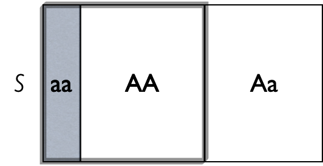
```

---

## Example
- We can define four events as follows:
$$\begin{array}{l@{\quad}l}
\text{The homozygous event:} & HM = \{\mathit{AA}, \mathit{aa}\}, \\
\text{The heterozygous event:} & HT  = \{\mathit{Aa}\},  \\  
\text{The no-disease event:} & ND   = \{\mathit{AA}, \mathit{Aa}\}, \\
\text{The disease event:} & D   = \{\mathit{aa}\} .
\end{array}$$
- Assume $P(\mathit{AA}) = 0.49$,
$P(\mathit{Aa}) = 0.42$, and $P(\mathit{aa}) = 0.09$. Then,
$$
\begin{eqnarray*}
P(HM ) & = & 0.49+0.09 = 0.58,  \\
P(HT ) & = & 0.42, \\
P(ND) & = & 0.49 + 0.42 = 0.91,\\
P(D) & = & 0.09.
\end{eqnarray*}
$$
---

## Complement
- For any event $E$, we define its **complement**, $E^c$, as the set
of all outcomes that are in the sample space $S$ but not in $E$.

- For the gene-disease example, the complement of the homozygous event
$HM  = \{\mathit{AA}, \mathit{aa}\}$ is the heterozygous event
$\{\mathit{Aa}\}$; we show this as $HM^{c} = HT$. 

- Likewise, the complement of the disease event, $D=\{\mathit{aa}\}$, is the no-disease
event, $ND = \{\mathit{AA}, \mathit{Aa}\}$; we show this as $D^{c} = ND$.

- The probability of the complement event is 1 minus the probability of
the event:
$$P\bigl(E^{c}\bigr) = 1- P(E).$$


---

## Union

- For two events $E_{1}$ and $E_{2}$ in a sample space $S$, we define
their **union** $E_{1}\cup E_{2}$ as the set of all outcomes that
are at least in one of the events. 

- The union $E_{1}\cup E_{2}$ is an
event by itself, and it occurs when **either** $E_{1}$ **or**
$E_{2}$ (or both) occurs. 

- For example, the
union of the heterozygous event, $HT$, and the disease event, $D$, is
$\{\mathit{Aa}\} \cup \{\mathit{aa}\} = \{\mathit{Aa}, \mathit{aa}\}$.

- When possible, we can identify the outcomes in the
union of the two events and find the probability by adding the
probabilities of those outcomes.

---


## Intersection

- For two events $E_{1}$ and $E_{2}$ in a sample space $S$, we define their **intersection** $E_{1} \cap E_{2}$ as the set of outcomes that are in **both** events. 

- The intersection $E_{1}\cap E_{2}$ is an event
by itself, and it occurs when both $E_{1}$ **and** $E_{2}$ occur.

- The intersection of
the homozygous event and the no-disease event is $HM  \cap ND = \{\mathit{AA}\}$.

- When possible, we can identify the outcomes in the
intersection of the two events and find the probability by adding the
probabilities of those outcomes.

---

## Joint vs. marginal probability
- We refer to the probability of the intersection of two events, $P(E_{1} \cap E_{2})$, as their **joint probability**. 

- In contrast, we refer to probabilities $P(E_{1})$ and $P(E_{2})$ as the **marginal probabilities** of events $E_{1}$ and $E_{2}$.

- For any two events $E_{1}$ and $E_{2}$, we have

$$P(E_{1} \cup E_{2}) = P(E_{1}) + P(E_{2}) - P(E_{1} \cap E_{2}).$$
- That is, the probability of the union $P(E_1 \cup E_2)$ is the sum of their marginal probabilities minus their joint probability. 

---

## Joint vs. marginal probability

- For example, the union of the heterozygous and the no-disease events is
$$\begin{eqnarray*}
P(HM  \cup ND)  &=&  P(HM ) + P(ND) - P(HM  \cap ND) \\
  &= & 0.58 + 0.91 - 0.49 = 1.
\end{eqnarray*}$$

---

## Disjoint events
- Two events are called **disjoint** or **mutually exclusive** if they never occur together: if we know that one of them has occurred, we can conclude that the other event has not occurred. 

- Disjoint events have no
elements (outcomes) in common, and their intersection is the empty set.

- For the above example, if a person is heterozygous, we know that he does not have the disease so the two events $HT$ and $D$ are disjoint. 


---

## Disjoint events

- For two disjoint events $E_{1}$ and $E_{2}$, the probability of their
intersection (i.e., their joint probability) is zero: 
$$P(E_{1} \cap E_{2}) = P(\phi) =  0$$
- Therefore, the probability of the union of the two disjoint events is simply the sum of their marginal probabilities: 
$$P(E_{1} \cup E_{2}) = P(E_{1}) + P(E_{2})$$
- In general, if we have multiple disjoint events, $E_1$, $E_2$, ..., $E_n$, then the probability of their union is the sum of the marginal probabilities:
$$P(E_1 \cup E_2 \cup ... \cup E_n) = P(E_1) + P(E_2) + ... + P(E_n)$$

---

## Partition

- When two or more events are disjoint and their union is the sample
space $S$, we say that the events form a **partition** of the
sample space.

- Two complementary events $E$ and $E^{c}$ always form a partition of the
sample space since they are disjoint and their union is the sample
space.

---

## Conditional probability

- Ver often, we need to discuss possible changes in the
probability of one event based on our knowledge regarding the
occurrence of another event.

- The **conditional probability**, denoted  $P(E_{1}|E_{2})$, is the
probability of event $E_1$ given that another event $E_2$ has occurred.

- The conditional probability of event $E_1$ given event $E_2$ can be
calculated as follows: (assuming $P(E_{2}) \ne 0$)

$$P(E_{1}|E_{2}) = \frac{P(E_{1} \cap E_{2})}{P(E_{2})}.$$

- This is the joint probability of the two events divided
by the marginal probability of the event on which we are conditioning.


---

## The law of total probability

- By rearranging the equation for conditional probabilities, we have
$$P(E_{1} \cap E_{2}) = P(E_{1}|E_{2})P(E_{2}).$$

- Now suppose that a set of $K$ events $B_1, B_2, \ldots, B_K$ forms a
partition of the sample space.
```{r, echo=FALSE,out.width='50%',fig.align='center'}
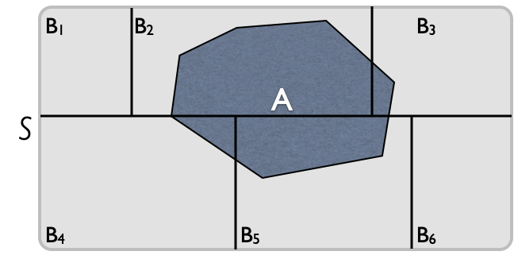
```

---

## The law of total probability

- Using the above equation, we have
$$P(A)  =  P(A|B_{1})P(B_{1}) + \cdots + P(A|B_{K})P(B_{K}).$$
- This is known as the **law of total probability**.


---

## Independent events

- Two events $E_{1}$ and $E_{2}$ are **independent** if our
knowledge of the occurrence of one event does not change the
probability of occurrence of the other event. 

\begin{eqnarray*}
P(E_{1}|E_{2}) & = & P(E_{1}), \\
P(E_{2}|E_{1}) & = & P(E_{2}).
\end{eqnarray*}

- For example, if a disease is not genetic, knowing a person has a specific genotype (e.g., $AA$) does not  change the probability of having that disease. 

---

## Independent events

- When two events $E_{1}$ and $E_{2}$ are independent, the probability
that $E_{1}$ and $E_{2}$ occur simultaneously, i.e., their joint
probability, is the product of their marginal probabilities:

$$P(E_{1} \cap E_{2}) = P(E_{1})\times P(E_{2})$$

- Therefore, the probability of the union of two independent events is as follows:
$$P(E_{1} \cup E_{2}) = P(E_{1}) + P(E_{2}) - P(E_{1}) \times P(E_{2}).$$


---

## Bayes' theorem

- Sometimes, we know the conditional
probability of $E_{1}$ given $E_{2}$, but we are interested in the
conditional probability of $E_{2}$ given $E_{1}$. 

- For example, suppose
that the probability of having lung cancer is $P(C) = 0.001$ and that
the probability of being a smoker is $P(SM) = 0.25$. 

- Further, suppose
we know that if a person has lung cancer, the probability of being a
smoker increases to $P(SM |C) = 0.40$.  

- We are, however, interested in
the probability of developing lung cancer if a person is a smoker,
$P(C|SM)$. 


---

## Bayes' theorem

- In general, for two events $E_1$ and $E_2$, the following equation
shows the relationship between $P(E_{2}|E_{1})$ and $P(E_{1}|E_{2})$:
$$P(E_{2}|E_{1})  =  \frac{P(E_{1}|E_{2})P(E_{2})}{P(E_{1})}.$$

- This formula is known as **Bayes' theorem** or **Bayes' rule**.

---

## Bayes' theorem

- For the above example, 
$$P(C|SM)  =  \frac{P(SM|C)P(C) }{P(SM)} = \frac{ 0.4 \times 0.001}{0.25} = 0.0016.$$

- Therefore, the probability of lung cancer for smokers increases from
0.001 to 0.0016. 


---

## Random Variables

- We now discuss random variables and their probability distributions.

- Formally, a **random variable** $X$ assigns a
numerical value to each possible outcome (and event) of a random
phenomenon. 

- For instance, we can define $X$ for possible genotypes
of a bi-allelic gene **A** as follows:
$$X = \left\{ \begin{array}{l@{\quad}l}
0 &  \mbox{for genotype } \mathit{AA}, \\
1 &  \mbox{for genotype } \mathit{Aa}, \\
2 &  \mbox{for genotype } \mathit{aa}.
\end{array} \right.$$


---

## Random Variables

- After we define a random variable, we can find the probabilities for
its possible values based on the probabilities specified for its underlying
random phenomenon. This way, instead of talking about the probabilities
for different outcomes and events, we can talk about the probability of
different values for a random variable. 

- For example, suppose $P({AA}) = 0.49$, $P({Aa}) = 0.42$, and $P({aa}) = 0.09$. 

- Then, we can say that $P(X=0) = 0.49$, i.e., $X$ is equal
to $0$ with probability of 0.49. 

- Note that the total probability for the random variable is still 1 and all the probability rules we discussed still hold. 


---

## Random Variables


- The probability distribution of a random variable specifies its
possible values (i.e., its range) and their corresponding
probabilities.

- For the random variable $X$ defined based on genotypes, the
probability distribution can be simply specified as follows:

$$P(X=x) = \left\{ \begin{array}{l@{\quad}l}
0.49 &  \mbox{for } x=0, \\
0.42 &  \mbox{for } x=1, \\
0.09 &  \mbox{for } x=2.
\end{array} \right.$$

- Here, $x$ denotes a specific value (i.e., 0, 1, or 2) of the random variable.


---


## Discrete vs. continuous random variables

- We divide the random variables into two major groups: **discrete** and
**continuous**. 

- Discrete random variables can take a countable set of
values.

- These variables can be categorical (nominal or ordinal), such
as genotype, or counts, such as the number of patients visiting an emergency room per day, 

- Continuous random variables, for example BMI, can take an uncountable number of possible
values.

- For any two possible values of this random variable, we can always find another
value between them. 

---

## Probability distributions

- The probability distribution of a random variable provides the required
information to find the probability of its possible values.

- The probability distributions discussed here are characterized by one or more
__parameters__.

- The parameters of probability distributions we assume for random variables are usually unknown.

---

## Discrete probability distributions

- For discrete random variables, the probability distribution is fully
defined by its **probability mass function** (pmf). 

- This is a function that specifies the probability of each possible value within the
range of random variable. 

- For the genotype example, the pmf of the
random variable $X$ is

$$P(X=x) = \left\{ \begin{array}{l@{\quad}l}
0.49 &  \mbox{for } x=0, \\
0.42 &  \mbox{for } x=1, \\
0.09 &  \mbox{for } x=2.
\end{array} \right.$$


---

## Discrete uniform distribution

- One of the most straightforward, yet useful distributions, is the one that assigns the same probability, regardless of the value. 

- For that reason, it is called __uniform probability distribution__. 

- A _discrete_ uniform distribution can be written as follow

$$P(X=x) = \left\{ \begin{array}{l@{\quad}l}
\frac{1}{k}  & x=1,...,k  \\
0 & \mbox{otherwise} \\
\end{array} \right.$$


---

## Bernoulli distribution

- Binary random variables (e.g., healthy/diseased) are abundant in scientific studies. 
- The binary random variable $X$ with possible values 0 and 1 has a **Bernoulli** distribution. 

- We denote $P(X=1) = \mu$, which mean $P(X=0) = 1 - \mu$, where $0 \le \mu \le 1$ is the mean (rate) of the random variable.

- For example,  
$$P(X=x) = \left\{ \begin{array}{l@{\quad}l}
0.2 &  \mbox{for } x=0, \\
0.8 &  \mbox{for } x=1.
\end{array} \right.$$


---

## Binomial distribution

- A sequence of binary random variables $X_{1}, X_{2}, \ldots, X_{n}$ is called **Bernoulli trials** if they all have the same Bernoulli distribution and  are independent. 

- The random variable $Y$ representing the number of times the outcome of interest occurs in $n$ Bernoulli trials (i.e., the sum of Bernoulli trials) has a **Binomial** distribution 

- The pmf of a binomial distribution specifies the probability of each possible value (integers from 0 through $n$) of the random variable.

- Binomial includes Bernoulli as a special case (n = 1). 


---

## Continuous probability distributions

- For discrete random variables, the pmf provides the probability of each
possible value. 

- For continuous random variables, the number of possible
values is uncountable, and the probability of any specific value is
zero. 

- For these variables, we are usually interested in the probability that the value of
the random variable is within a specific interval from $x_{1}$ to
$x_{2}$; we show this probability as $P(x_{1} < X \le x_{2})$. 


---

## Probability density function

- For continuous random variables, we use **probability density functions** (pdf) to specify the distribution. Using the pdf, we can obtain the probability of any interval. 

```{r, echo=FALSE,out.width='25%',out.height='60%',fig.align='center',fig.cap='Probability density function for BMI'}
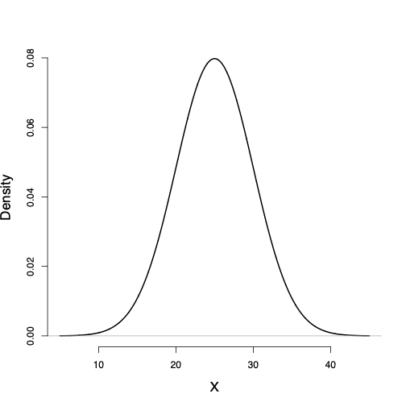
```


---

## Probability density function

- The total area under the probability density curve is 1. 

- The curve (and its corresponding function) gives the probability of the random variable falling within an interval. 

- This probability is equal to the area under the probability density curve over the interval.
```{r, echo=FALSE,out.width='25%',out.height='60%',fig.align='center'}
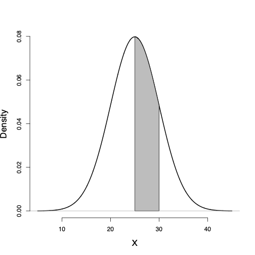
```


---

## Lower tail probability
- the probability of observing
values less than or equal to a specific value $x$, is called the lower
tail probability and is denoted as $P(X \le x)$. 

```{r, echo=FALSE,out.width='25%',out.height='60%',fig.align='center'}
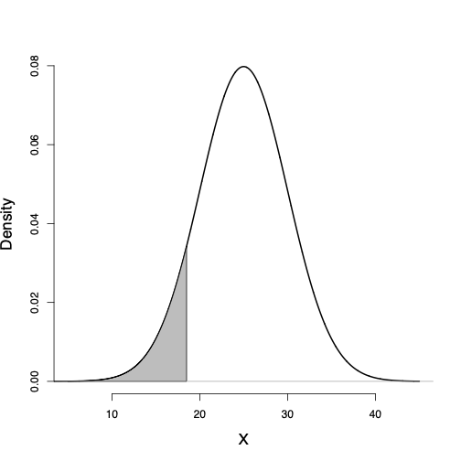
```

---

## Upper tail probability

- The probability of observing values greater than $x$, $P(X > x)$, is called the upper tail probability and is found by
measuring the area under the curve to the right of $x$. 

```{r, echo=FALSE,out.width='25%',out.height='60%',fig.align='center'}
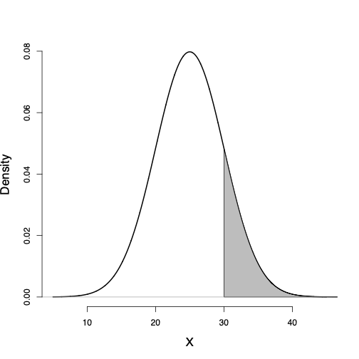
```

---

## Probability of intervals

- The probability of any interval from $x_{1}$ to $x_{2}$, where $x_{1} < x_{2}$, can be obtained using the corresponding lower tail probabilities for these two points as follows:
$$\begin{equation*}
P(x_1 < X \le x_2) = P(X \le x_2) - P(X \le x_1).
\end{equation*}$$

- For example, the probability of a BMI between 25 and 30 is
$$\begin{equation*}
P(25 < X \le 30) = P(X \le 30) - P(X \le 25).
\end{equation*}$$


---

## Continuous Uniform Distribution

- We previously saw discrete uniform distribution; we now discuss its continuous version. 

- Let $a$ and $b$ be two real numbers, so that $a<b$. The following the pdf of a __continuous uniform distribution__: 

$$f(x) = \left\{ \begin{array}{l@{\quad}l}
\frac{1}{b-a}  & a<x<b  \\
0 & \mbox{otherwise} \\
\end{array} \right.$$


```{r, echo=FALSE,out.width='50%',out.height='60%',fig.align='center'}
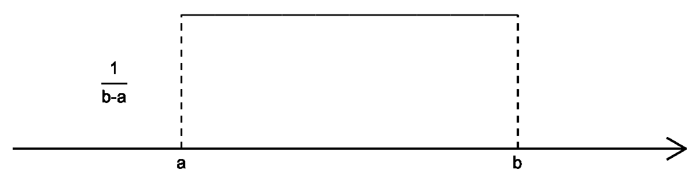
```


---

## Normal distribution

- Consider the probability distribution function and its corresponding probability density curve we assumed for BMI in the above example. 

- This distribution is known as **normal** distribution, which is one of the most widely used distributions for continuous random variables. 

- Random variables with this distribution (or very close to it) occur often in nature.

---

## Normal distribution

- A **normal distribution** and its corresponding pdf are fully specified by the mean (usually denoted as $\mu$) and variance (usually denoted as $\sigma^2$): 

$$N(\mu, \sigma^2)$$ 

- $N(0, 1)$ is called the **standard normal distribution**.
```{r, echo=FALSE,out.width='25%',out.height='60%',fig.align='center'}
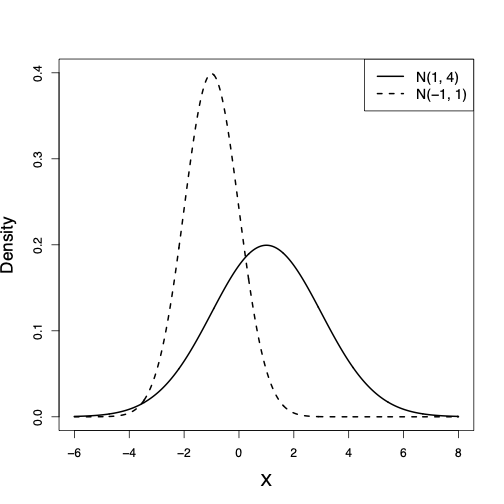
```


---

## The 68-95-99.7% rule

- The 68--95--99.7% rule for normal distributions specifies that

  + 68% of values fall within 1 standard deviation of the mean

  + 95% of values fall within 2 standard deviations of the mean

  + 99.7% of values fall within 3 standard deviations of the mean


---

## Normal Distribution

```{r, echo=FALSE,out.width='40%',out.height='30%',fig.show='hold',fig.align='center'}
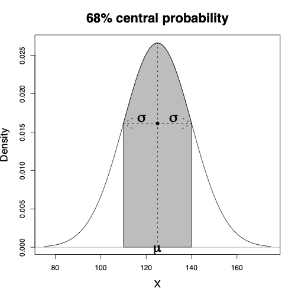
```


---

## Normal Distribution

```{r, echo=FALSE,out.width='40%',out.height='49%',fig.show='hold',fig.align='center'}
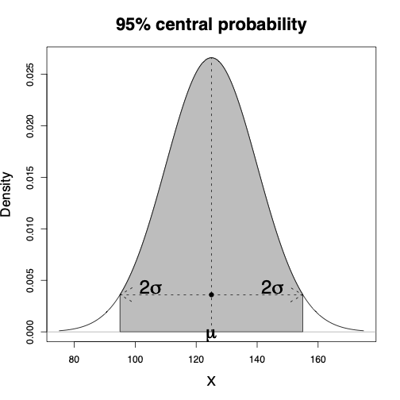
```


---

## Student's t-distribution

Another continuous probability distribution that is used very often in
statistics is the __Student's__ $t$-__distribution__ or
simply the $t$-distribution.


```{r, echo=FALSE,out.width='35%',out.height='35%',fig.show='hold',fig.align='center'}
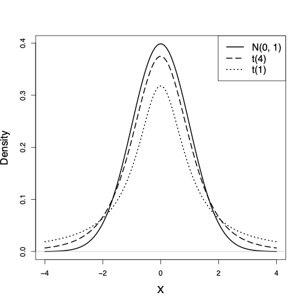
```
