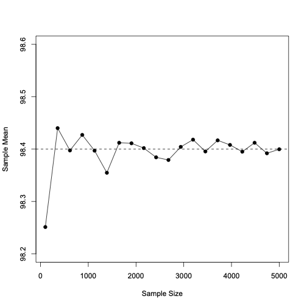
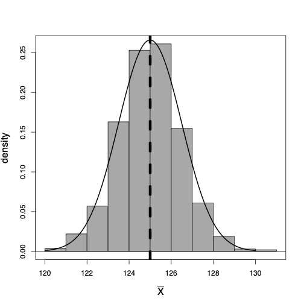
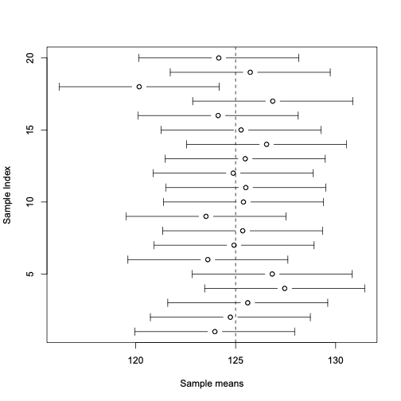
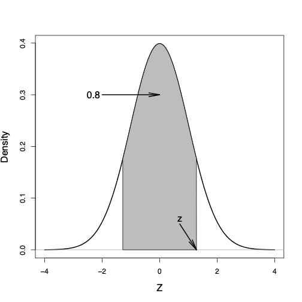

class: title-slide

```{r echo = FALSE}
library(fabricerin)
```

<br>
<br>
.right-panel[ 
<br>

# `r rmarkdown::metadata$title`

### `r rmarkdown::metadata$author`

]


---

## Parameter estimation

- We are interested in population mean and population variance, denoted as  $\mu$ and $\sigma^{2}$ respectively, of a
random variable. 

- These quantities are unknown in general. 

- We refer to these unknown quantities **parameters**.

- In the previous lecture, you learned about statistical methods for parameter **estimation**. 

- Estimation refers to the process of guessing the
unknown value of a parameter (e.g., population mean) using the observed
data. 


---

## Point estimation vs. interval estimation 


- Sometimes we only provide a single value as our estimate: sample mean for population mean and sample variance for population variance.

- This is called **point estimation**. 

- We use $\hat{\mu}$ and $\hat{\sigma}^{2}$ to denote the point estimates for $\mu$ and $\sigma^{2}$. 

- Point estimates do not reflect our uncertainty.

- To address this issue, we can present our estimates in terms of a range of possible values (as opposed to a single value).

- This is called **interval estimation**.


---

## Estimating population mean


- Given $n$ observed values, $X_{1}, X_{2}, \ldots, X_{n}$, from the
population, we can estimate the population mean $\mu$ with the sample mean:
$$
\begin{equation*}
\bar{X} = \frac{\sum_{i=1}^{n}X_{i}}{n}.
\end{equation*}
$$

- In this case, we say that $\bar{X}$ is an __estimator__ for $\mu$.

- The estimator itself is considered as a random variable since it value can change. 

---

## Estimating population mean

- We usually have only one sample of size $n$ from the population $x_{1}, x_{2}, \ldots, x_{n}$. 

- Therefore, we only have one value for $\bar{X}$, which we denote $\bar{x}$:
$$
\begin{equation*}
\bar{x} = \frac{\sum_{i=1}^{n}x_{i}}{n}
\end{equation*}
$$

---

## Law of Large Numbers (LLN)

- The __Law of Large Numbers (LLN)__ indicates that (under some
general conditions such as independence of observations) the sample
mean converges to the population mean, $\bar{X}_{n} \to\mu$, as the sample size $n$ increases, $n \to\infty$. 

- Informally, this means that the difference between the sample mean and the population mean tends to become smaller and smaller as we increase the sample size. 

- The Law of Large Numbers provides a theoretical
justification for the use of sample mean as an estimator for the
population mean.

- The Law of Large Numbers is true regardless of the underlying
distribution of the random variable. 


---

## Law of Large Numbers (LLN)

Suppose the true population mean for normal body temperature is 98.4F. 

```{r, echo=FALSE,out.width='40%',fig.align='center'}

```

---

## Law of Large Numbers (LLN)

- The Law of Large Numbers is true regardless of the underlying distribution of the random variable. 

- Therefore, it justifies using the sample mean $\bar{X}$ not only to estimate the population mean for continuous random variables, but also for discrete random variables, whose values are counts and for discrete binary variables, whose possible values are 0 and 1 only. 

- For count variables, the mean is usually referred to as the __rate__ (e.g., rate of traffic accidents). 

- For binary random variables, the mean is usually referred to as the __proportion__ of the outcome of interest (denoted as 1). 


---

## Estimating population variance

- Given $n$ randomly sampled values $X_{1}, X_{2}, \ldots, X_{n}$ from
the population and their corresponding sample mean $\bar{X}$, we estimate the population variance as follows:
$$
\begin{equation*}
S^{2}  =  {\frac{\sum_{i=1}^{n}(X_{i} - \bar{X})^{2}}{n-1}}.
\end{equation*}
$$

- The sample standard deviation $S$ (i.e., square root of
$S^2$) is our estimator of the population standard deviation ${\sigma}$.


---

## Estimating population variance

- We regard the estimator $S^{2}$ as a random variable.

- In practice, we usually have one set of observed values,
$x_{1}, x_{2}, \ldots, x_{n}$, and therefore, only one value for
$S^{2}$:

$$
\begin{equation*}
s^{2}  =  \frac{\sum_{i=1}^{n}(x_{i} - \bar{x})^{2}}{n-1}.
\end{equation*}
$$

---

## Sampling distribution

- The value of estimators discussed so far (and all estimators in general) depend on the specific sample selected from the population.

- If we repeat our sampling, we are likely to obtain a different value for an estimator. 

- Therefore, we regard the estimators themselves as random variables. 

- As the result, similar to any other random variable, we can talk about their probability distribution. 

- Probability distributions for estimators are called __sampling distributions__. 


---

## Sampling distribution

- We focus on the sampling distribution of the sample mean $\bar{X}$.

- We start by assuming that the random variable of interest, $X$, has a
normal $N(\mu, \sigma^{2})$ distribution. 

- Further, we assume that the population variance $\sigma^{2}$ is known, so the only parameter we want to estimate is $\mu$.

- In this case:
$$\begin{equation*}
\bar{X}  \sim N\bigl(\mu, \sigma^{2}/n\bigr).
\end{equation*}$$
where $n$ is the sample size. 


---

## Sampling distribution
<center>


</center>
Left: The (unknown) theoretical distribution of blood pressure: $X\sim N(125, 15^2)$. Right: The density curve for the sampling distribution $\bar{X} \sim N(125, 15^{2}/100)$ along with the histogram of 1000 sample means. 


---

## Confidence intervals for the population mean

- It is common to express our point estimate along with its standard
deviation to show how much the estimate could vary if different members
of population were selected as our sample. 

- Alternatively, we can use
the point estimate and its standard deviation to express our estimate
as a range (interval) of possible values for the unknown parameter.


---
## Confidence intervals for the population mean


- We know that $\bar{X} \sim N(\mu, \sigma^2/n)$. 

- Suppose that $\sigma^2 = 15^2$ and sample size is $n=100$.

- Following the __68-95-99.7%__ rule, with 0.95 probability, the
value of $\bar{X}$ is within 2 standard deviations from its mean, $\mu$,
$$\begin{equation*}
\mu- 2\times1.5 \le\bar{X} \le\mu+ 2 \times1.5.
\end{equation*}$$

- In other words, with probability 0.95,
$$\begin{equation*}
\mu- 3 \le\bar{X} \le\mu+ 3.
\end{equation*}$$

---

##Confidence intervals for the population mean

- We are, however, interested in estimating the population mean $\mu$
(instead of the sample mean $\bar{X}$). 

- By rearranging the terms of the
above inequality, we find that with
probability 0.95,
$$\begin{equation*}
\bar{X} - 3 \le\mu\le\bar{X} + 3.
\end{equation*}$$

- This means that with probability 0.95, the population mean $\mu$ is in
the interval $[\bar{X} - 3, \bar{X} + 3]$.


---

## Confidence intervals for the population mean}
- In reality, we usually have only one sample of $n$
observations, one sample mean $\bar{x}$, and one interval $[\bar{x} - 3, \ \bar{x} + 3]$ for the population mean $\mu$. 

- For the blood pressure example, suppose that
we have a sample of $n=100$ people and that the sample mean is $\bar{x}=123$. Therefore, we have one interval as follows:
$$\begin{equation*}
[123 - 3, 123 + 3] = [120, 126].
\end{equation*}$$

- We refer to this interval as our 95% __confidence interval__ for the population mean $\mu$.

---

## Interpretation of confidence interval

```{r, echo=FALSE,out.width='40%',fig.align='center'}

```

---

## $z$-critical value

- In general, when the population variance $\sigma^{2}$ is known, the 95% confidence interval for $\mu$ is
obtained as follows:
$$\begin{equation*}
\bigl[\bar{x} - 2 \times\sigma/ \sqrt{n},\ \bar{x} + 2 \times\sigma/\sqrt{n}\,\bigr]
\end{equation*}$$

- We need a bigger interval if we want to be more confident, e.g., 99.7%:
$$\begin{equation*}
\bigl[\bar{x} - 3 \times\sigma/ \sqrt{n},\ \bar{x} + 3 \times\sigma/\sqrt{n}\,\bigr]
\end{equation*}$$

- Sometimes we can afford to be less confident, e.g., 68%:
$$\begin{equation*}
\bigl[\bar{x} - 1 \times\sigma/ \sqrt{n},\ \bar{x} + 1 \times\sigma/\sqrt{n}\,\bigr]
\end{equation*}$$


---

## $z$-critical value

- In general, the confidence interval for the population mean at
$c$ (e.g., 0.8) confidence level is
\begin{eqnarray*}
[\bar{x} - z_{crit}\times \sigma / \sqrt{n}, \ \bar{x}  + z_{crit} \times \sigma / \sqrt{n}]
\end{eqnarray*}


---

## $z$-critical value
- We calculated $z_{crit}$ by finding the $(1+c)/2$ quantile from the standard normal distribution. 

```{r, echo=FALSE,out.width='30%',fig.align='center'}

```


---

## Central limit theorem

- So far, we have assumed that the random variable has normal distribution, so the sampling distribution of $\bar{X}$ is normal too.

- If the random variable is not normally distributed, the sampling distribution of $\bar{X}$ can be considered as _approximately_ normal using (assuming the samples are independent and the sample size is large enough) the __central limit theorem (CLT)__:
_If the random variable $X$ has the population mean $\mu$ and the population variance $\sigma^{2}$, then the sampling distribution of $\bar{X}$ is approximately normal with mean $\mu$ and variance $\sigma^{2}/n$._

- Note that CLT is true regarding the underlying distribution of $X$ so we can use it for random variables with Bernoulli and Binomial distributions too.


---

## Population Proportion


- For binary random variables, we are interested in estimating the population proportion, $\mu$. 

- For the corresponding Bernoulli distribution, the mean is $\mu$ and the variance is $$\sigma^2 = \mu(1-\mu)$$

- Therefore, if estimate the $\mu$, we estimate both mean and variance (i.e., theoretical population mean and population variance). 


---

## Population Proportion

- Since estimating the population variance does not introduce an additional source of uncertainty to our analysis, so we do not need to use a $t$-distribution instead of the standard normal distribution.

- Given the sample proportion $p$, the confidence interval for the population proportion is obtained as follows:

$$\begin{equation}
[p - z_{crit} \times\sqrt{p(1-p)/n}, \quad p + z_{crit} \times\sqrt{p(1-p)/n}]
\end{equation}$$


---
## Confidence Interval When the Population Variance is Unknown

- So far, we have assumed the population variance, $\sigma^{2}$, of
the random variable is known or can be directly calculated using the mean for binary variables.

- However, we almost always need to estimate $\sigma^{2}$
along with the population mean $\mu$. 

- For this, we use the sample variance $s^{2}$.

- As a result, the standard deviation for $\bar{X}$ is estimated to be $s/\sqrt{n}$. 


---

## Confidence Interval When the Population Variance is Unknown

- To find confidence intervals for the population mean when the population variance is unknown, we follow similar steps as described above, but
  - instead of $\sigma/\sqrt{n}$ we use $s/\sqrt{n}$, 
  - instead of $z_{\mathrm{crit}}$ based on the standard normal distribution, we use $t_{\mathrm{crit}}$ obtained from a $t$-distribution with $n-1$ degrees of freedom. 

-  The confidence interval for the population mean at
$c$ confidence level is
$$\begin{equation*}
\bigl[\bar{x} - t_{\mathrm{crit}}\times s / \sqrt{n}, \ \bar{x} + t_{\mathrm{crit}} \times s /
\sqrt{n}\,\bigr],
\end{equation*}$$


---

## Margin of error

- We refer to $s/\sqrt{n}$ as the __standard error__ of the sample mean $\bar{X}$.

- We can write the confidence interval as 
$$\begin{equation*}
\bar{x} \pm t_{\mathrm{crit}}\times SE
\end{equation*}$$


- The term $t_{\mathrm{crit}}\times SE$ is called the
**margin of error** for the given confidence level. 


- It is common to present interval estimates for a given confidence level as
$$\begin{equation*}
\textrm{Point estimate} \pm\textrm{Margin of error.}
\end{equation*}$$

