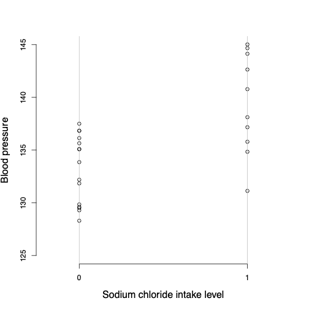
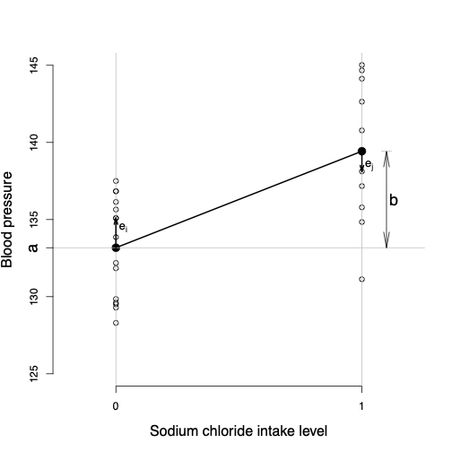
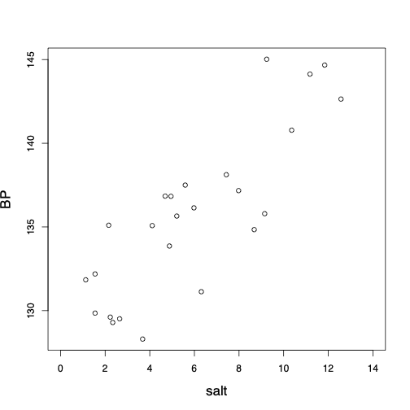
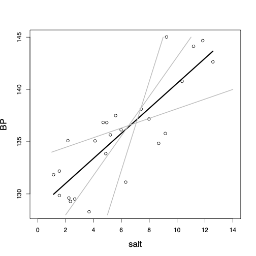

class: title-slide

```{r echo = FALSE}
library(fabricerin)
```

<br>
<br>
.right-panel[ 
<br>

# `r rmarkdown::metadata$title`

### `r rmarkdown::metadata$author`

]


<style type="text/css">

body, td {
   font-size: 14px;
}
code.r{
  font-size: 20px;
}
pre {
  font-size: 20px
}
</style>

---

### Introduction

- We now discuss **simple linear regression** models, where the objective is to either explain the variation in a numerical **response variable** or predict its unknown values using another variable called **explanatory variable** or **predictor** (depending its role).

- We use $X$ to denote explanatory variable and $Y$ to denote response variable. 

- We start by focusing on problems where the explanatory variable is binary. As before, the binary variable $X$ can be either 0 or 1. 

- We then continue our discussion for situations where the explanatory variable is numerical.


---

### One Binary Explanatory Variable


- Suppose that we want to investigate the relationship between sodium chloride (salt) consumption (low vs. high consumption) and blood pressure among elderly people (e.g., above 65 years old). 

```{r, echo=FALSE,out.width='32%',out.height='40%',fig.align='center'}

```


---

### One Binary Explanatory Variable


- The following figure shows the dot plot along with sample means, shown as black circles, for each group. We connect the two sample means to show the overall pattern for how blood pressure changes from one
group to another.

```{r, echo=FALSE,out.width='32%',out.height='40%',fig.align='center'}

```


---

### One Binary Explanatory Variable


- Using the intercept $a$ and slope $b$, we can write the equation for
the straight line that connects the estimates of the response variable for different values of $X$ as follows:
$$\begin{equation*}
\hat{y}  =  a + b x.
\end{equation*}$$

- The slope is also knows as the **regression coefficient** of $X$.

- For this example,
$$\begin{equation*}
\hat{y}  =  133.17 + 6.25 x.
\end{equation*}$$

---

### One Binary Explanatory Variable

- We expect that on average the blood
pressure increases by 6.25 units for one unit increase in $X$. 

- In this case, one unit increase in $X$ from 0
to 1 means moving from low to high sodium chloride
diet group.


---

### One Binary Explanatory Variable

- For an individual with $x=0$ (i.e., low sodium chloride diet), the estimate according to the above regression line is
$$\begin{eqnarray*}
\hat{y} & = & a + b \times 0 = a \\
& = & \hat{y}_{x=0},
\end{eqnarray*}$$
which is the sample mean for the first group. 


---

### One Binary Explanatory Variable

- For an individual with $x=1$ (i.e., high sodium chloride diet), the estimate according to the above regression line is
$$\begin{eqnarray*}
\hat{y} & = & a + b \times 1 = a+b \\
& = & \hat{y}_{x=0} + \hat{y}_{x=1} - \hat{y}_{x=0} \\
& = & \hat{y}_{x=1}.
\end{eqnarray*}$$


---

### One Binary Explanatory Variable


- We refer to the difference between the observed and estimated values of
the response variable as the **residual**. 

- For individual $i$, we denote the residual $e_{i}$ and calculate it as follows:
$$\begin{equation*}
e_{i}  =  y_{i} - \hat{y}_{i}.
\end{equation*}$$

- For instance, if someone belongs to the first group, her estimated blood pressure is $\hat{y}_{i} = a =133.17$. 

- Now if the observed value of her blood pressure is $y_{i} = 135.08$, then the residual is
$$\begin{equation*}
e_{i}  = 135.08 - 133.17 = 1.91.
\end{equation*}$$


---

### Residual sum of squares

- As a measure of discrepancy between the observed values and those
estimated by the line, we calculate the **Residual Sum of
Squares** (RSS):
$$\begin{equation*}
\mathit{RSS} =  \sum_{i}^{n} e_{i}^{2}.
\label{RSS}
\end{equation*}$$

- Here, $e_i$ is the residual of the $i$th observation, and $n$ is the
sample size. 

- The square of each residual is used so that its sign becomes irrelevant.

---

### One Numerical Explanatory Variable


- We now discuss simple linear regression models (i.e., linear regression with only one explanatory variable), where the explanatory variable is numerical.

```{r, echo=FALSE,out.width='35%',out.height='40%',fig.align='center'}

```


---

### One Numerical Explanatory Variable


- Among all possible lines we can pass through the data, we choose the one with the smallest sum of squared residuals, called the **least-squares regression line**.


```{r, echo=FALSE,out.width='35%',out.height='40%',fig.align='center'}

```


```{r message=FALSE, echo=FALSE}
library(tidyverse)
library(ggplot2)
library(MASS)
library(mfp)
data("birthwt")
data("Pima.tr")
data(bodyfat, package="mfp")
saltBP <- read.table(file="data/saltBP.txt", header=T, sep="")
```


---

### Statistical inference using regression models

- We can use the function `lm()` or `glm()` in R to find the least-squares regression line. 

```{r}
lm(BP ~ salt, data=saltBP)
```


---

### Statistical inference using regression models

- We can use the function `lm()` or `glm()` in R to find the least-squares regression line. 

```{r}
glm(BP ~ salt, data=saltBP)
```

---

### Residual

- Given $x$, we can find the expected value of $y$ for each subject. 

- For one individual in our sample, the amount of daily sodium chloride intake is $x_{i} = 3.68$. 

- The estimated value of the blood pressure for this person is
$$\begin{equation*}
\hat{y}_{i}  =  128.60 + 1.20 \times 3.68 = 133.02.
\end{equation*}$$

- The actual blood pressure for this individual is $y_{i} = 128.3$. The residual therefore is
$$\begin{equation*}
e_{i} = y_{i} - \hat{y}_{i} = 128.3 - 133.02 = - 4.72.
\end{equation*}$$


---

### Prediction

- We can also use our model for **predicting** the unknown values of the
response variable (i.e., blood pressure) for all individuals in the target population. 

- For example, if we know the amount of daily sodium chloride intake is $x=7.81$ for an individual, we can predict her blood pressure as follows:
$$\begin{equation*}
\hat{y}  =  128.60 + 1.20 \times 7.81 = 137.97.
\end{equation*}$$


---

### Interpretation


- The interpretation of the intercept $a$ and the slope $b$ is similar to what we had before.

- $a=128.6$: the *expected* value of blood pressure is 128.6 for subjects with zero sodium chloride diet.

- $b=1.2$: the *expected* value of blood pressure increases by 1.2 points corresponding to one unit increase in the daily amount of sodium chloride intake.


---

### Confidence interval

```{r, message=FALSE}
lm_res <- glm(BP ~ salt, data=saltBP)
confint(lm_res)
```


---

### Hypothesis testing

- The null hypothesis indicates that the population regression coefficient is zero, $$H_0: \beta = 0$$ 

- This is interpreted as no linear relationship between the response variable and the explanatory variable 

- The alternative hypothesis is usually two-sided
$$H_A: \beta \ne 0$$
- The corresponding p-value is provided by the `glm()` function.

---

### Hypothesis testing

```{r, message=FALSE}
summary(lm_res)
```

---

### Model Assumptions and Diagnostics


- The typical assumptions of linear regression models are

  - Linearity

  - Independent observations

  - Constant variance and normality of the error term (residuals)

- The first two assumptions are usually justified by our domain knowledge, our study design, and simple visualization of data.

- To investigate the validity of the third assumptions we can use diagnostic plots by visualizing the residuals


---

### Multiple Linear Regression

- So far, we have focused on linear regression models with only one
explanatory variable. 

- In most cases, however, we are interested in the
relationship between the response variable and multiple explanatory variables. 

- Such models with multiple explanatory variables or predictors are called **multiple linear regression**
models.

- For example, we might want to examine how the birthweight of babies is associated with their mother age and smoking status. 


---

### Multiple Linear Regression

- A multiple linear regression model with $p$ explanatory variables can
be presented as follows:

$$\begin{equation*}
\hat{y}  =  a + b_{1}x_{1} + b_{2}x_{2} + \cdots + b_{p}x_{p}.
\end{equation*}$$

- To fit this model, we can use R as before.


---

### Multiple Linear Regression

```{r message=FALSE}
library(MASS)
data("birthwt")
bwt_mod <- glm(bwt ~ age + factor(smoke), data=birthwt)
bwt_mod
```


---

### Multiple Linear Regression

```{r message=FALSE}
confint(bwt_mod)
```


---

### Multiple Linear Regression

```{r message=FALSE}
summary(bwt_mod)
```

---

### Interpretation

- The intercept in multiple linear regression model is the expected (average) value of the response variable when all the explanatory variables in the model are set to zero simultaneously. 

- In the above example, the intercept is $a=2791$, which is obtained by setting age and smoking to zero. 

- We might be tempted to interpret this as the average birthweight of babies for nonsmoking mothers (smoke=0) with age equal to zero. 

- In this case, however, this is not a reasonable interpretation since mother's age cannot be zero.


---

### Interpretation

- We interpret $b_{j}$ as our estimate of the expected (average) change in the response variable
associated with a unit increase in the corresponding explanatory variable $x_{j}$ **while all other explanatory variables in the model remain fixed**.

- For the above example, the point estimate of the regression coefficient for {age} is $b_{1}=11$, and the estimate of the regression coefficient for {smoke} is $b_{2} = -278$. 

---

### Interpretation

- We expect that the birthweight of babies increase by 11 grams as the mother's age increases by one year among mothers with the same smoking status. 

- The expected birthweight changes by $-278$ (decreases by $278$) grams associated with one unit increase in the value of the variable smoke among mothers with the same age.


