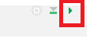

class: title-slide

```{r echo = FALSE, warning=FALSE}
library(fabricerin)

```

<br>
<br>
.right-panel[ 

# `r rmarkdown::metadata$title`
## `r rmarkdown::metadata$author`

Adapted from slides by Mine Dogucu
]


---

class: inverse middle center

.font150[~~R~~ Markdown]
---


***R Markdown*** is a file format for making dynamic documents with R. An R Markdown document is written in markdown (an easy-to-write plain text format) and contains chunks of embedded R code.

***R Markdown*** files are the source code for rich, reproducible documents. 

```{r message = FALSE , error = FALSE, echo = FALSE}
library(dplyr)
```


---

class: inverse middle

.font100[`r fontawesome::fa(name = "r-project", fill = "#1B3D6D")` = .R file]

.font100[`r fontawesome::fa(name = "markdown", fill = "#1B3D6D")` = .md file]

.font100[`r fontawesome::fa(name = "r-project", fill = "#1B3D6D")` + `r fontawesome::fa(name = "markdown", fill = "#1B3D6D")` = .Rmd file]

---
.important[ You can transform an R Markdown file in two ways:
]

- knit: You can knit the file. The rmarkdown package will call the knitr package. knitr will run each chunk of R code in the document and append the results of the code to the document next to the code chunk.

- convert: You can convert the file. The rmarkdown package will use the pandoc program to transform the file into a new format. For example, you can convert your .Rmd file into an HTML, PDF, or Microsoft Word file.


---

```{r echo=FALSE, out.width='100%'}
knitr::include_graphics('img/rmd-parts.jpeg')
```

---
class: center middle

## Add Chunk

```{r echo=FALSE, out.width='50%'}
knitr::include_graphics('img/code-chunk.png')
```

---

class: center middle

## Run the Current Chunk

```{r echo=FALSE, out.width='20%'}

```


---

class: center middle 

## Knit

```{r echo=FALSE, out.width='50%'}
knitr::include_graphics('img/knit.png')
```

---
```{r echo=FALSE, out.width='90%'}

```

---
##YAML

- Title
- Subtitle
- Author
- Date
- Table of content
---
##Inline Code
To embed R code in a line of text, surround the code with a pair of backticks and the letter r, like this.

- Two plus two equals `r 2 + 2`.

```{r echo=FALSE, out.width='90%'}
knitr::include_graphics('img/rmd-inline.png')
```
---
# Inline Code Example

```{r}
cyl_prcnt <-
  mtcars %>% 
  count(cyl) %>% 
  mutate(prcnt = n/sum(n)*100) %>%
  filter(cyl == 4) %>%
  select(prcnt)

```

$$\\[0.05in]$$

**`r cyl_prcnt`** percent of cars in our dataset have 4 cylinders. 


```{r echo=FALSE, out.width='50%'}

```

-[mtcars data dictionary](https://stat.ethz.ch/R-manual/R-devel/library/datasets/html/mtcars.html)

---
class: middle center


## Shortcuts

|                            | Windows          | Mac              |
|----------------------------|------------------|------------------|
| add chunk                  | Ctrl + Alt + I   | Cmd + Option + I |
| run the current chunk      | Ctrl + Alt + C   | Cmd + Option + C |
| run current line/selection | Ctrl + Enter     | Cmd + Return     |
| knit                       | Ctrl + Shift + K | Cmd + Shift + K  |


---

class: middle

## Summary of our Tools

**R** is a programming language used mainly for statistical computing. 

**markdown** is a markup language for creating formatted text.

**R Markdown** is a file format that can handle R and markdown (and many other languages).

**RStudio** is an integrated development environment (IDE). 

---

class: middle

## R vs. RStudio

- You can write English (a language, so is R) words in a notebook (like RStudio).  
- But you can also write it elsewhere too (on a napkin, sand etc. or even in different notebooks).   
- R is a language that can be written in many different places, RStudio is just one of them.   
- There are many others.  
